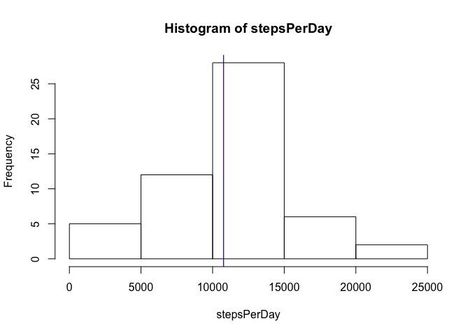

Thank you for reviewing my assignment!


## Loading and preprocessing the data
In a first step, the data provided for this project is read in and saved in an dataframe called "data". Second, the factor "date" is converted to the class "date". Third, I remove missing data (NA values in the "steps" column.

```r
data<-read.csv("./activity.csv", sep=",")
data$date<-as.Date(data$date, format = "%Y-%m-%d")
processedData<-data[complete.cases(data),]
```

## What is mean total number of steps taken per day?
To answer this question I first compute the total steps taken per day.

```r
stepsPerDay<-tapply(processedData$steps, processedData$date, sum)
```
The distribution of steps per day has the following shape:

```r
hist(stepsPerDay)
abline(v=mean(stepsPerDay), col="red")
abline(v=median(stepsPerDay), col="blue")
```

<!-- -->

The vertical red line in the histogram shows the mean, the blue line the median. The two values lie very close together. The mean and median steps per day can be easily computed using the function summary:

```r
summary(stepsPerDay)
```

```
##    Min. 1st Qu.  Median    Mean 3rd Qu.    Max. 
##      41    8841   10765   10766   13294   21194
```

## What is the average daily activity pattern?
To answer this question I first compute the mean steps per interval over all day and store them in the variable "meanstepsPerInterval". Then I plot them against the starting points of the intervals. 


```r
meanstepsPerInterval<-tapply(processedData$steps, processedData$interval, mean)
plot(unique(processedData$interval),meanstepsPerInterval, type="l", main = "Average daily activity pattern", xlab="time interval", ylab = "mean steps")
```

<!-- -->

The daily interval with the maximum mean steps is: 

```r
meanstepsPerInterval[match(max(meanstepsPerInterval), meanstepsPerInterval)]
```

```
##      835 
## 206.1698
```
08:35-08:40 AM.

## Imputing missing values

```r
naCount<-sum(is.na(data$steps))
```
The number of missing values in the original data set is 2304.
I choose the strategy to fill NA values with the mean value of the corresponding interval over all days.
The new data set with imputed missing values is stored in the dataframe object "newdata".


```r
newdata <- data
naIndex <- is.na(newdata$steps)
meanInterval <- tapply(newdata$steps, newdata$interval, mean, na.rm=TRUE, simplify = TRUE)
newdata$steps[naIndex] <- meanInterval[as.character(newdata$interval[naIndex])]
```

Then I recompute the mean steps per day with the tapply function as in the second part of the exercise:

```r
newStepsPerDay<-tapply(newdata$steps, newdata$date, sum)
```

The corresponding histogram of mean steps per day looks as follows:

```r
hist(newStepsPerDay)
abline(v=mean(newStepsPerDay), col="red")
abline(v=median(newStepsPerDay), col="blue")
```

<!-- -->

The new histogram looks very much like the one obtained ignoring the NAs. In fact, the mean and mean values are now the same and almost identical to the values in the previous histogram:


```r
summary(newStepsPerDay)
```

```
##    Min. 1st Qu.  Median    Mean 3rd Qu.    Max. 
##      41    9819   10766   10766   12811   21194
```

From this we can conclude that ignoring missing values doesn't systematically alter the distribution of our data. 

## Are there differences in activity patterns between weekdays and weekends?

First I create a new variable "day" with factor levels "weekday" and "weekend".


```r
library(plyr)
library(dplyr)
```

```
## 
## Attaching package: 'dplyr'
```

```
## The following objects are masked from 'package:plyr':
## 
##     arrange, count, desc, failwith, id, mutate, rename, summarise,
##     summarize
```

```
## The following objects are masked from 'package:stats':
## 
##     filter, lag
```

```
## The following objects are masked from 'package:base':
## 
##     intersect, setdiff, setequal, union
```

```r
newdata<- newdata%>%
        mutate(day= ifelse(weekdays(newdata$date)=="Samstag" | weekdays(newdata$date)=="Sonntag", "weekend", "weekday"))
newdata<-transform(newdata, day=factor(day))
```

The command table summarizes the proportion of weekends and weekdays in the data:

```r
table(newdata$day)
```

```
## 
## weekday weekend 
##   12960    4608
```

Plotting the number of steps across intervals for weekends and weekdays separately yields the following pattern:


```r
library(lattice)
xyplot(newdata$steps~newdata$interval | day, data=newdata, layout=c(1,2), type="l", xlab="interval", ylab = "number of steps", main="Activity patterns weekend vs weekdays")
```

<!-- -->

It appears that activity is more evenly distributed throughout the day on weekdays.
